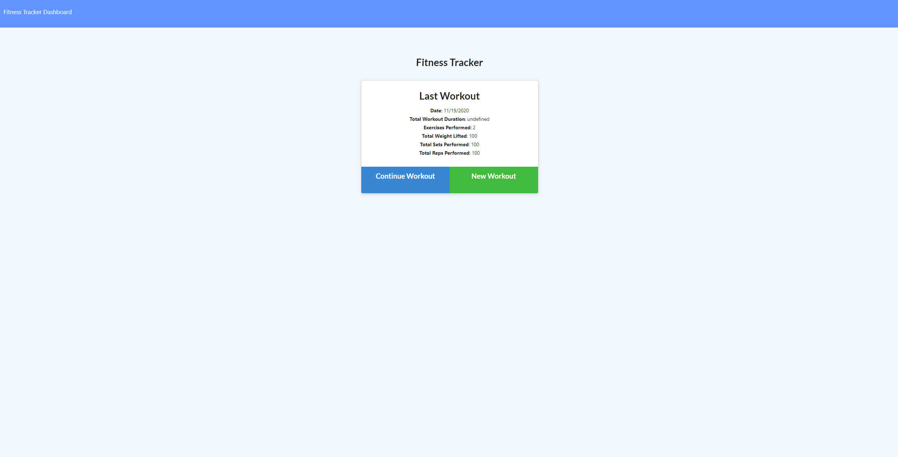
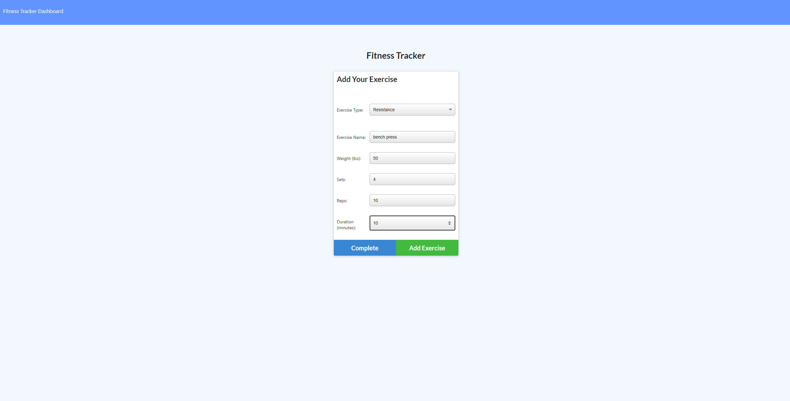
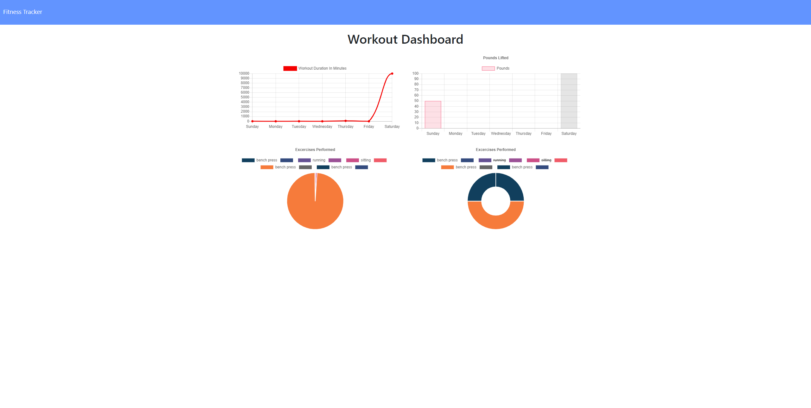

# **Work Out Tracker**

## Description 
Keep track of your exercise and track your work out. Record, log, and track your work outs.

### Example imgage

## Table of contents
- [Description](#Description)
- [Installation](#Installation)
- [Usage](#Usage)
- [Licence](#Licence)
- [Contributors](#Contributors)
- [Test](#Test)
- [Repository Link](#Repository)
- [GitHub Info](#GitHub) 
## Installation
  Run:

        npm i
        
## Usage
Start server

        node server.js

## Licence

## Contributors
Just me Jordan Kirby

## Test
no test

## Repository
- [work-out-tracker](https://github.com/Feizhi255/work-out-tracker)
## GitHub

- Jordan Kirby
- [Feizhi255](https://github.com/Feizhi255)
## Questions? send me an email title it with the Repo name plz
- <jrock255@hotmail.com>
